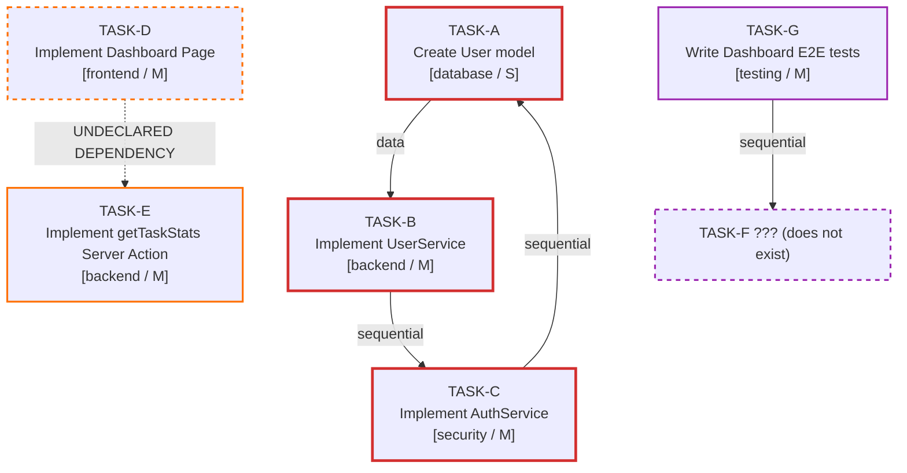
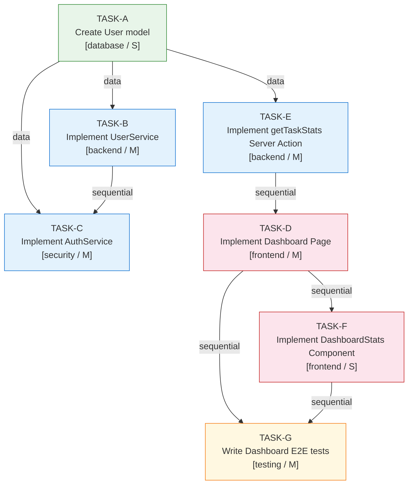

# Bad Dependency Graph Example
## Project: TaskFlow SaaS (BROKEN VERSION)
## has_cycles: TRUE | Gate 3 Status: BLOCKED_AMBIGUOUS_DEPENDENCY

---

## Problems in This Graph

This graph has THREE critical problems:

1. **Circular dependency:** TASK-A → TASK-B → TASK-C → TASK-A (topological sort is impossible)
2. **Undeclared dependency:** TASK-D uses output of TASK-E but does not declare it in `depends_on[]`
3. **Missing node:** TASK-F is referenced in `depends_on` by TASK-G but does not exist in the plan

---

## Broken Dependency Graph (Mermaid)



---

## Problem 1: Circular Dependency — TASK-A → TASK-B → TASK-C → TASK-A

### The Cycle

```
TASK-A (Create User model)
  ↓ depends on
TASK-B (Implement UserService)
  ↓ depends on
TASK-C (Implement AuthService)
  ↓ depends on
TASK-A ← BACK EDGE (cycle!)
```

### Why This Breaks Everything

Topological sort requires a Directed Acyclic Graph (DAG). When a cycle exists:
- Kahn's algorithm: TASK-A, TASK-B, and TASK-C are never added to the sort queue because each has an unsatisfied in-degree
- DFS: detects a back edge from TASK-C to TASK-A, reporting `has_cycles: true`
- **Implementation consequence:** There is no valid order to implement these tasks. You cannot create the User model without UserService being done, but UserService needs AuthService, which needs the User model to already exist.

### What Actually Happened

The dependency is wrong. The real relationship is:
- TASK-A (User model) has no dependencies — it's the root
- TASK-B (UserService) depends on TASK-A (needs the model)
- TASK-C (AuthService) depends on TASK-A (also needs the model) and TASK-B (needs the service)

**Fix:** Remove the edge TASK-C → TASK-A. Add TASK-A as a root node. Recompute topological sort.

### Gate 3 Verdict for Circular Dependency

```
gate_status: BLOCKED_AMBIGUOUS_DEPENDENCY
blocking_condition: "Circular dependency detected: TASK-A → TASK-B → TASK-C → TASK-A"
rule: DR002
escalation: Required — if cycle is architectural (not a mistake), Tech Lead must resolve
```

---

## Problem 2: Undeclared (Implicit) Dependency — TASK-D → TASK-E

### The Problem

TASK-D (Dashboard Page) renders task statistics. To do this, it must call the `getTaskStats` Server Action produced by TASK-E.

However, TASK-D's `depends_on` array is empty: `"depends_on": []`

The relationship is implicit — assumed but not declared.

### What Would Happen at Runtime

If TASK-D is assigned to Agente05 (frontend) before TASK-E is complete:
- The frontend developer starts implementing the Dashboard Page
- They try to import `getTaskStats` from TASK-E's file
- TASK-E does not exist yet — compilation fails
- Development stops while waiting for TASK-E to be completed
- The parallel work was wasted

### The Fix

Add TASK-E to TASK-D's `depends_on[]`:

```json
"depends_on": ["TASK-E"]
```

Then re-run `dependency-graph-skill` to verify:
- Topological sort still valid
- TASK-E now appears before TASK-D in the sort order
- TASK-D cannot start until TASK-E is complete

### Gate 3 Verdict for Undeclared Dependency

```
gate_status: RETURNED_FOR_REVISION
blocking_condition: "TASK-D has undeclared dependency on TASK-E (implicit data dependency)"
rule: P3, FM-07
action: Add TASK-E to TASK-D depends_on[]; re-run dependency graph
```

---

## Problem 3: Missing Node — TASK-G → TASK-F (does not exist)

### The Problem

TASK-G (Dashboard E2E tests) declares `"depends_on": ["TASK-F"]`, but TASK-F does not exist anywhere in the plan.

This could mean:
- TASK-F was planned and then removed, but TASK-G's `depends_on` was not updated
- TASK-F was never created (missing decomposition)
- TASK-F refers to a task by the wrong ID

### What Would Happen at Runtime

- The dependency graph builder cannot create an edge from TASK-G to TASK-F
- Schema validation fails: `"depends_on" contains task_id 'TASK-F' which does not exist in the plan`
- Gate 3 validation: RETURNED_FOR_REVISION

### The Fix

Option A: TASK-F was removed → Remove "TASK-F" from TASK-G's `depends_on[]`, and add the correct dependency
Option B: TASK-F is missing from the plan → Create TASK-F with proper definition, add to plan

### Gate 3 Verdict for Missing Node

```
gate_status: RETURNED_FOR_REVISION
blocking_condition: "TASK-G depends_on contains 'TASK-F' which does not exist in plan"
rule: DR004 (all referenced IDs must be valid)
action: Either remove orphaned reference or add missing task TASK-F
```

---

## Corrected Graph (What It Should Look Like)

After fixing all 3 problems:



```
DFS result: has_cycles = false
Topological sort: [TASK-A, TASK-B, TASK-C, TASK-E, TASK-D, TASK-F, TASK-G]
Gate 3 verdict: APPROVED (after other plan checks pass)
```
