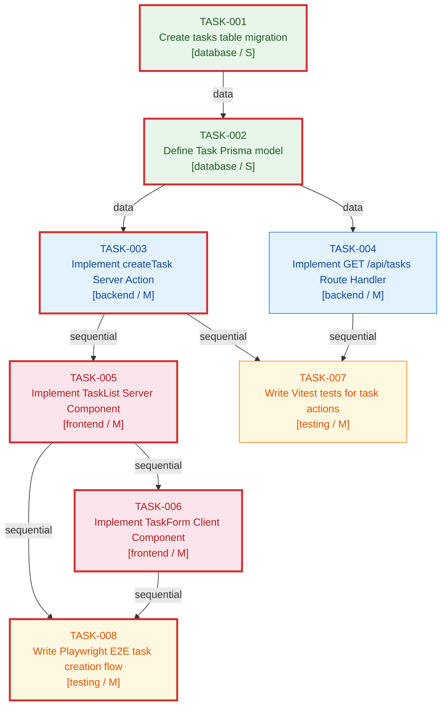

# Good Dependency Graph Example
## Project: TaskFlow SaaS
## Plan: plan-taskflow-saas-v1
## has_cycles: false | Critical Path: 6 tasks | Parallel Tracks: 2

---

## Why This Graph is Well-Formed

- All 8 tasks appear as nodes
- All dependency edges are explicit and typed (sequential/data/file)
- No cycles detected (DFS result: has_cycles = false)
- Topological sort is valid and reflects safe implementation order
- Parallel tracks are identified and annotated
- Critical path is computed (longest chain = 6 tasks)
- Color coding distinguishes task types for quick visual review

---

## Dependency Graph (Mermaid)



**Legend:**
- Green nodes = database/infrastructure tasks
- Blue nodes = backend tasks
- Red/pink nodes = frontend tasks
- Yellow nodes = testing tasks
- Bold border = critical path

---

## Full Dependency Table

| Task | Task Title | Type | Depends On | Dependency Type | Can Run in Parallel With |
|------|-----------|------|------------|----------------|--------------------------|
| TASK-001 | Create tasks table migration | database | — | — | — (root node) |
| TASK-002 | Define Task Prisma model | database | TASK-001 | data | — |
| TASK-003 | Implement createTask Server Action | backend | TASK-002 | data | TASK-004 |
| TASK-004 | Implement GET /api/tasks Route Handler | backend | TASK-002 | data | TASK-003 |
| TASK-005 | Implement TaskList Server Component | frontend | TASK-003 | sequential | TASK-004, TASK-007 |
| TASK-006 | Implement TaskForm Client Component | frontend | TASK-005 | file | TASK-007 |
| TASK-007 | Write Vitest tests for task actions | testing | TASK-003, TASK-004 | sequential | TASK-005, TASK-006 |
| TASK-008 | Write Playwright E2E task creation flow | testing | TASK-005, TASK-006 | sequential | TASK-007 |

---

## Parallel Tracks

| Track Name | Tasks | Start Condition | Notes |
|-----------|-------|----------------|-------|
| Track A: Backend Parallel | TASK-003, TASK-004 | After TASK-002 complete | Backend dev can split: one implements Server Action, other implements Route Handler |
| Track B: Frontend + Testing | TASK-005 (frontend) and TASK-007 (testing) | After TASK-003+004 complete | Frontend dev starts components; test dev starts Vitest tests simultaneously |

---

## Critical Path

The critical path is the longest dependency chain. It determines the minimum possible delivery time.

```
TASK-001 → TASK-002 → TASK-003 → TASK-005 → TASK-006 → TASK-008
```

| Position | Task | Title | Complexity | Weight |
|----------|------|-------|-----------|--------|
| 1 | TASK-001 | Create tasks table migration | S | 1 |
| 2 | TASK-002 | Define Task Prisma model | S | 1 |
| 3 | TASK-003 | Implement createTask Server Action | M | 2 |
| 4 | TASK-005 | Implement TaskList Server Component | M | 2 |
| 5 | TASK-006 | Implement TaskForm Client Component | M | 2 |
| 6 | TASK-008 | Write Playwright E2E task creation flow | M | 2 |

**Critical path weight:** 10 units | **Off-critical-path tasks:** TASK-004, TASK-007

---

## Topological Order (Safe Implementation Order)

```
[TASK-001, TASK-002, TASK-003, TASK-004, TASK-005, TASK-006, TASK-007, TASK-008]
```

Notes:
- TASK-003 and TASK-004 can swap positions (both come after TASK-002 with no mutual dependency)
- TASK-007 must come after both TASK-003 and TASK-004
- TASK-008 must come after both TASK-005 and TASK-006

---

## Cycle Detection Result

DFS cycle detection — PASSED

```
Visited: [TASK-001, TASK-002, TASK-003, TASK-004, TASK-005, TASK-006, TASK-007, TASK-008]
Back edges found: 0
has_cycles: false
```

Gate 3 cycle check: PASS
