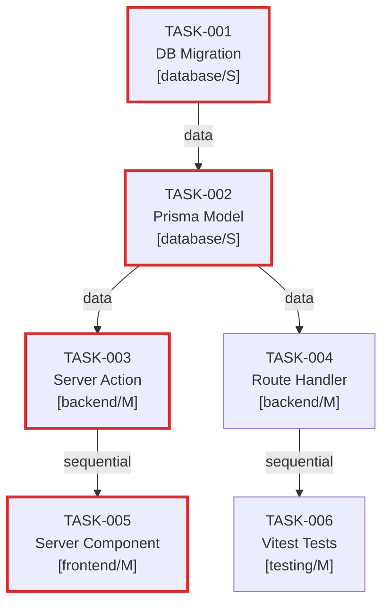

# Good Output — Dependency Graph Skill

## Scenario: 6-task plan with valid acyclic graph

**graph_id:** graph-taskflow-v1
**has_cycles:** false
**topological_order:** [TASK-001, TASK-002, TASK-003, TASK-004, TASK-005, TASK-006]
**critical_path:** [TASK-001, TASK-002, TASK-003, TASK-005]
**parallel_tracks:** [[TASK-003, TASK-004], [TASK-005, TASK-006]]

**edges:**
- TASK-001 → TASK-002 (data)
- TASK-002 → TASK-003 (data)
- TASK-002 → TASK-004 (data)
- TASK-003 → TASK-005 (sequential)
- TASK-004 → TASK-006 (sequential)

**Mermaid source:**

**Why this is good:**
- has_cycles: false (DFS found no back edges)
- Topological order is valid (TASK-001 before TASK-002, etc.)
- Parallel tracks correctly identified: TASK-003 and TASK-004 share only TASK-002 as dependency, no mutual dependency
- Critical path computed: TASK-001 (S=1) + TASK-002 (S=1) + TASK-003 (M=2) + TASK-005 (M=2) = weight 6
