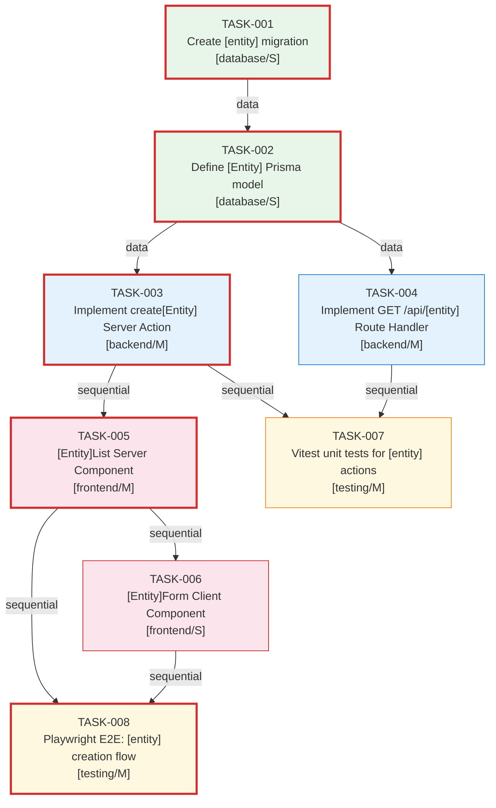

# Dependency Graph
## Project: [Project Name]
## Graph ID: [graph-id]
## Plan ID: [plan-id]
## Generated: [ISO 8601 timestamp]

---

## Summary

| Metric | Value |
|--------|-------|
| Total Nodes | [N] |
| Total Edges | [N] |
| Has Cycles | false |
| Critical Path Length | [N] tasks |
| Parallel Tracks | [N] |
| Topological Order Valid | true |

---

## Dependency Graph (Mermaid)



---

## Task Dependency Table

| Task ID | Task Title | Type | Depends On | Dependency Type | Can Run In Parallel With |
|---------|-----------|------|------------|----------------|--------------------------|
| TASK-001 | [title] | database | — | — | — |
| TASK-002 | [title] | database | TASK-001 | data | — |
| TASK-003 | [title] | backend | TASK-002 | data | — |
| TASK-004 | [title] | backend | TASK-002 | data | TASK-003 |
| TASK-005 | [title] | frontend | TASK-003 | sequential | TASK-004, TASK-007 |
| TASK-006 | [title] | frontend | TASK-005 | file | TASK-007 |
| TASK-007 | [title] | testing | TASK-003, TASK-004 | sequential | TASK-005, TASK-006 |
| TASK-008 | [title] | testing | TASK-005, TASK-006 | sequential | TASK-007 |

---

## Parallel Tracks

| Track Name | Tasks | Start Condition |
|-----------|-------|----------------|
| Backend Track | TASK-003, TASK-004 | After TASK-002 complete |
| Frontend Track | TASK-005, TASK-006 | After TASK-003 complete |
| Testing Track | TASK-007, TASK-008 | TASK-007 after TASK-003+004; TASK-008 after TASK-005+006 |

---

## Critical Path

```
TASK-001 → TASK-002 → TASK-003 → TASK-005 → TASK-008
```

**Critical Path Details:**

| # | Task ID | Title | Complexity | Cumulative Weight |
|---|---------|-------|-----------|-----------------|
| 1 | TASK-001 | [title] | S | 1 |
| 2 | TASK-002 | [title] | S | 2 |
| 3 | TASK-003 | [title] | M | 4 |
| 4 | TASK-005 | [title] | M | 6 |
| 5 | TASK-008 | [title] | M | 8 |

---

## Topological Order (Implementation Order)

```
TASK-001, TASK-002, TASK-003, TASK-004, TASK-005, TASK-006, TASK-007, TASK-008
```

---

## Notes

- TASK-003 and TASK-004 can be developed in parallel after TASK-002 is complete
- Testing tasks should be started as soon as their dependencies are available — do not defer to end
- Replace all `[entity]`, `[Entity]`, and `[title]` placeholders with actual values
