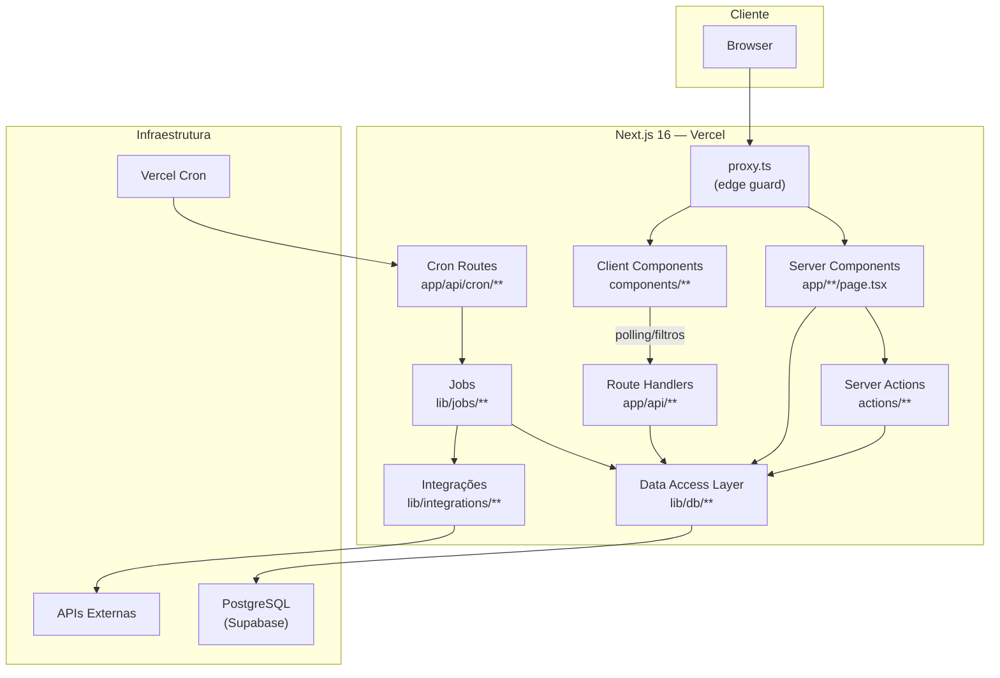
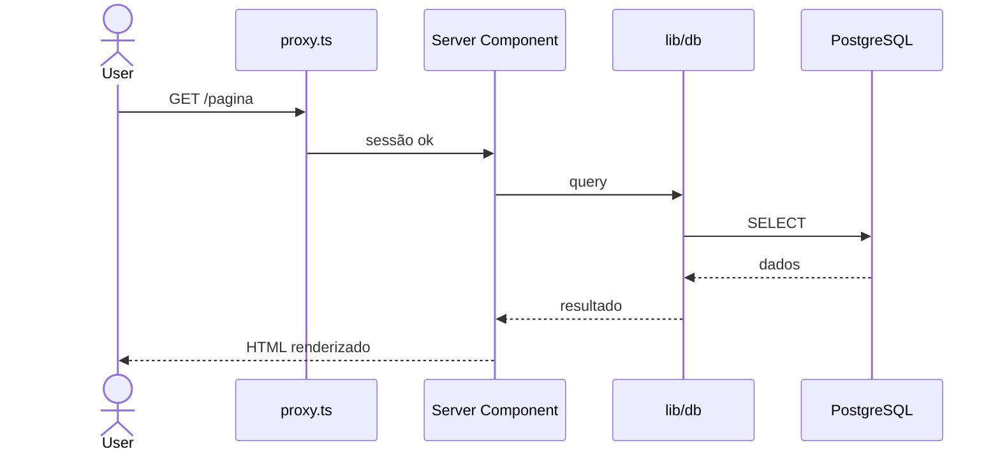
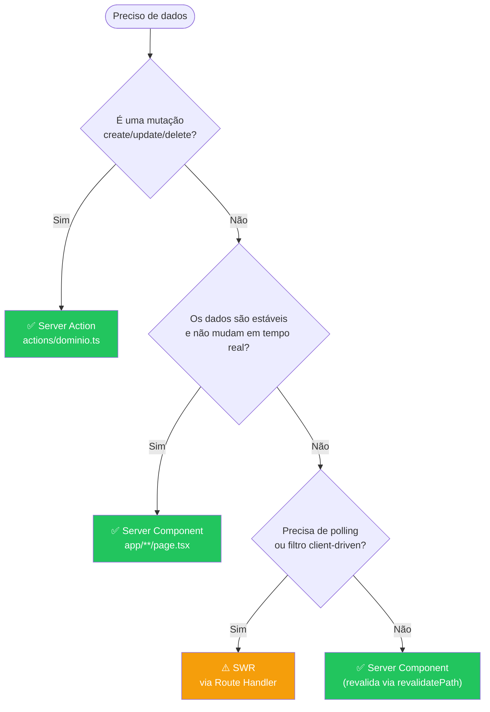
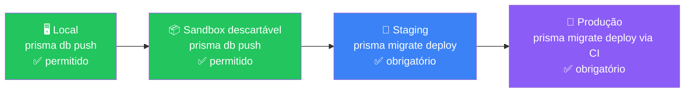
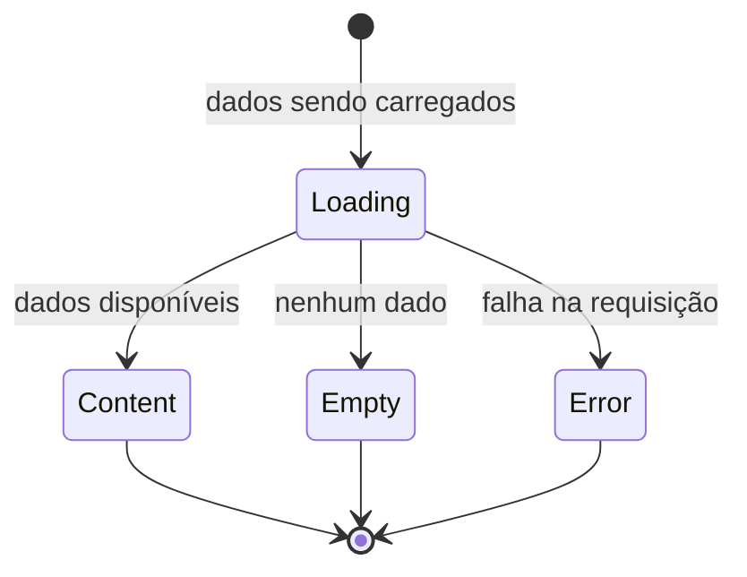
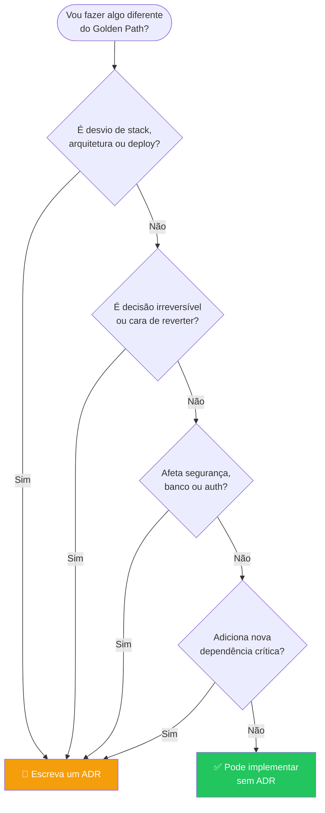

# Golden Model — Padrão Técnico de Engenharia

**Raiz Educação | v1.2.0**
Documento normativo para todos os times de engenharia.

---

## Para quem é este documento

Este documento é para **qualquer pessoa que escreva, revise ou decida sobre código** nos projetos internos da Raiz Educação:

- Devs backend e frontend
- Tech Leads e arquitetos
- QA e DevSecOps
- DevOps e SRE
- Novos integrantes do time

Ele define o que fazemos, como fazemos e por que fazemos assim — e também o que nunca fazemos.

---

## Como usar este documento

| Situação | Onde ir |
|---|---|
| Sou novo no time e quero configurar o ambiente | [Seção 1 — Onboarding](#1-onboarding--setup-do-zero) |
| Quero saber a stack aprovada | [Seção 2 — Stack](#2-stack-aprovada) |
| Quero entender a arquitetura | [Seção 3 — Arquitetura](#3-arquitetura-base) |
| Quero saber como buscar dados | [Seção 4 — Data Fetching](#4-data-fetching) |
| Vou usar banco de dados | [Seção 5 — Banco de Dados](#5-banco-de-dados-e-prisma) |
| Vou implementar autenticação ou segurança | [Seção 6 — Segurança e LGPD](#6-segurança-autenticação-e-lgpd) |
| Vou escrever testes | [Seção 7 — Testes e QA](#7-testes-e-qa) |
| Vou criar componente ou tela | [Seção 8 — Frontend e Design System](#8-frontend-e-design-system) |
| Vou criar job ou cron | [Seção 9 — Jobs e Crons](#9-jobs-e-crons) |
| Vou fazer deploy | [Seção 10 — Deploy e Operação](#10-deploy-e-operação) |
| Quero desviar do padrão | [Seção 11 — Processo de Exceção ADR](#11-processo-de-exceção-adr) |
| Preciso de uma referência rápida | [Quick Reference](#quick-reference) |

---

## Princípios

Antes das regras, os princípios que as explicam.

**P1 — Simplicidade antes de abstração**
A solução mais simples que resolve o problema real é a certa. Generalize só quando houver repetição real.

**P2 — Segurança por padrão**
A configuração padrão é segura. Qualquer abertura (acesso público, flexibilização de auth, dados em log) precisa ser explícita e justificada.

**P3 — Auditabilidade**
Toda ação humana ou automatizada que afete dados, permissões ou configurações deve ser rastreável.

**P4 — Falhar cedo e claramente**
Configurações inválidas, variáveis ausentes e contratos quebrados devem falhar no boot ou CI — nunca silenciosamente em produção.

**P5 — Zero segredo no código**
Nenhuma credencial, token ou chave no código-fonte. Segredos vivem em variáveis de ambiente.

**P6 — Escalabilidade progressiva**
Comece simples. Escale quando houver evidência de necessidade, não antecipação.

---

## 1. Onboarding — Setup do Zero

### 1.1 Pré-requisitos

| Ferramenta | Versão mínima | Verificação |
|---|---|---|
| Node.js | 20 LTS | `node -v` |
| npm | 10+ | `npm -v` |
| Git | qualquer recente | `git -v` |
| VS Code | qualquer recente | — |

### 1.2 Clonar e instalar

```bash
git clone <url-do-repositorio>
cd <nome-do-projeto>
npm install
```

O `postinstall` roda `prisma generate` automaticamente.

### 1.3 Configurar variáveis de ambiente

```bash
cp .env.example .env.local
```

Abra `.env.local` e preencha todas as variáveis marcadas como obrigatórias.
**Nunca commite `.env.local`.** Ele já está no `.gitignore`.

As variáveis obrigatórias estão documentadas em `lib/env.ts`. Se uma variável obrigatória estiver ausente, a aplicação não sobe — isso é intencional.

### 1.4 Banco de dados

```bash
# Garante que o schema está sincronizado com o banco local
npx prisma migrate deploy

# Se for ambiente completamente novo (sandbox descartável)
npx prisma db push  # apenas local — nunca em staging/produção
```

### 1.5 Rodar o projeto

```bash
npm run dev
```

Acesse `http://localhost:3000`.

### 1.6 Verificar que tudo está funcionando

```bash
npm run typecheck   # TypeScript sem erros
npm run lint        # ESLint sem erros
npm run test        # Vitest — todos os testes passando
npm run build       # Build completo sem erros
```

Se algum desses falhar antes de você mudar qualquer coisa, sinalize ao Tech Lead — o repo tem um problema de baseline.

### 1.7 Acesso ao banco de dados (Supabase)

Peça ao Tech Lead:
- Acesso ao projeto no Supabase (ambiente de desenvolvimento)
- A string de conexão do pooler para `.env.local`
- Acesso ao Vercel para ver variáveis de ambiente de staging

---

## 2. Stack Aprovada

### 2.1 Versões aprovadas

| Tecnologia | Linha aprovada | Observação |
|---|---|---|
| **Next.js** | 16.x | App Router obrigatório |
| **React** | 19.x | — |
| **TypeScript** | 5.x | strict mode obrigatório |
| **Tailwind CSS** | 4.x | configuração via `@theme` |
| **Prisma** | 7.x | com PrismaPg adapter |
| **PostgreSQL** | 16+ | via Supabase |
| **pg** | 8.x | driver direto |
| **NextAuth** | 5.x | Google OAuth |
| **@auth/prisma-adapter** | 2.x | — |
| **SWR** | 2.x | polling/revalidação client-side |
| **Recharts** | 3.x | gráficos e dashboards |
| **Zod** | 3.x | validação runtime |
| **Vitest** | 2.x | testes unitários e integração |
| **Playwright** | última estável | testes E2E |
| **Nodemailer** | 7.x | e-mail transacional |
| **axios** | 1.x | cliente HTTP externo |
| **next-themes** | 0.4.x | dark mode |

### 2.2 Política de versões

- **Patch** (ex: 7.0.1 → 7.0.2): pode ser atualizado via Renovate/Dependabot sem aprovação manual.
- **Minor** (ex: 7.0 → 7.1): revisar changelog e testar. Sem ADR, mas com aprovação do Tech Lead.
- **Major** (ex: 7 → 8): exige validação humana explícita e atualização deste documento.
- **Beta/RC** (ex: next-auth 5.x beta): exige consciência explícita do time e revisão periódica.

### 2.3 Scripts obrigatórios no `package.json`

```json
{
  "scripts": {
    "postinstall": "prisma generate",
    "dev": "next dev",
    "typecheck": "tsc --noEmit",
    "build": "tsc --noEmit && next build",
    "start": "next start",
    "lint": "eslint",
    "test": "vitest run",
    "test:watch": "vitest",
    "test:coverage": "vitest run --coverage",
    "migrate:deploy": "prisma migrate deploy"
  }
}
```

---

## 3. Arquitetura Base

### 3.1 Visão geral

O Golden Path é um **monorepo fullstack Next.js** onde frontend e backend convivem no mesmo repositório. Não separar em repositórios diferentes sem ADR aprovado.



### 3.2 Camadas e responsabilidades

| Camada | Localização | Faz | Não faz |
|---|---|---|---|
| **Proxy / Edge Guard** | `proxy.ts` | Verificação otimista de sessão, proteção de cron | Lógica de negócio |
| **Auth** | `auth.ts` | NextAuth v5, providers, callbacks | — |
| **Server Components** | `app/**/page.tsx` | Leitura inicial, renderização servidor | Estado local, interatividade |
| **Client Components** | `components/**/*.tsx` | UI interativa, estado local | Acesso direto ao banco |
| **Server Actions** | `actions/**/*.ts` | Mutações autorizadas | Leitura de dados iniciais |
| **Route Handlers** | `app/api/**/route.ts` | Endpoints REST finos | Regra de negócio, acesso direto ao banco |
| **Cron Routes** | `app/api/cron/**/route.ts` | Entrada dos jobs agendados | Lógica de job |
| **DAL** | `lib/db/**/*.ts` | Toda consulta ao banco | Lógica de negócio |
| **Jobs** | `lib/jobs/**/*.ts` | Lógica de coleta e processamento | Acesso direto ao banco (usa DAL) |
| **Integrações** | `lib/integrations/**` | Clientes de APIs externas | Acesso ao banco |

### 3.3 Fluxos de dados

**Leitura estável (mais comum)**


**Mutação**
```mermaid
sequenceDiagram
    actor User
    User->>Client Component: clica em botão
    Client Component->>Server Action: chama action
    Server Action->>auth(): verifica sessão
    auth()-->>Server Action: sessão
    Server Action->>Server Action: verifica autorização
    Server Action->>lib/db: escreve dado
    Server Action->>audit_log: registra ação
    Server Action->>revalidatePath(): invalida cache
    revalidatePath()-->>User: página atualizada
```

**Job agendado**
```mermaid
sequenceDiagram
    Vercel Cron->>Cron Route: GET /api/cron/job
    Cron Route->>guardCron(): valida secret
    guardCron()-->>Cron Route: ok
    Cron Route->>lib/jobs: executa job
    lib/jobs->>API Externa: coleta dados
    API Externa-->>lib/jobs: resposta
    lib/jobs->>lib/db: persiste
    lib/jobs->>sync_log: registra execução
    Cron Route-->>Vercel Cron: 200 ok
```

### 3.4 Estrutura de pastas padrão

```
app/
  (protected)/          # rotas autenticadas
  api/
    cron/               # jobs agendados
    health/             # healthcheck
    [recurso]/          # endpoints REST finos
  login/
  pending-approval/
  layout.tsx
  globals.css

components/
  ui/                   # componentes base
  layout/               # navbar, sidebar, etc
  charts/               # Recharts wrappers
  domain/               # componentes de domínio

actions/
  [dominio].ts          # Server Actions por domínio

features/
  [dominio]/
    [dominio].schema.ts
    [dominio].service.ts
    [dominio].repository.ts
    [dominio].types.ts

lib/
  prisma.ts             # singleton Prisma
  env.ts                # variáveis de ambiente validadas
  fmt.ts                # formatadores
  admin.ts              # helpers de autorização
  email.ts              # cliente de e-mail
  db/
    sync-log.ts
    audit-log.ts
    [dominio].ts
  jobs/
    cron-guard.ts
    concurrency.ts
    collect-[dominio].ts
  integrations/
    [servico]/

types/
  next-auth.d.ts
  [dominio].ts

prisma/
  schema.prisma
  migrations/

docs/
  adr/                  # Architecture Decision Records
  runbooks/             # procedimentos de incidente

tests/
  unit/
  integration/
  e2e/

proxy.ts
auth.ts
next.config.ts
prisma.config.ts
vercel.json
```

---

## 4. Data Fetching

### 4.1 Hierarquia de decisão

Use sempre nesta ordem. Só avance para o próximo nível quando o anterior não resolver.



### 4.2 Regras por camada

**Server Components**
- Use para carregamento inicial, listagens, relatórios, páginas protegidas
- Acessa `lib/db` diretamente — sem `fetch`, sem SWR
- Se a sessão for necessária, chame `auth()` no topo da função

**Server Actions**
- Toda mutação passa por aqui
- Valide: input (Zod) → sessão (`auth()`) → autorização → escreva → `audit_log` se sensível → `revalidatePath`
- Nunca exponha erro interno ao cliente

**SWR**
- Apenas quando há necessidade real de polling ou filtros client-driven
- Sempre com `revalidateOnFocus: false`
- Fetcher padrão:
```ts
const fetcher = (url: string) => fetch(url).then(r => {
  if (!r.ok) throw new Error(`HTTP ${r.status}`);
  return r.json();
});
```

**Route Handlers (`route.ts`)**
- Casca fina: valida auth → chama `lib/` → retorna `NextResponse.json()`
- Não contém regra de negócio
- Não acessa banco diretamente

---

## 5. Banco de Dados e Prisma

### 5.1 Stack padrão

- **Banco:** PostgreSQL no Supabase (connection string do pooler, porta 5432, session mode)
- **ORM:** Prisma 7 com PrismaPg adapter
- **Configuração:** `prisma.config.ts` com `dotenv.config()` — datasource sem `url` no `schema.prisma`
- **Singleton:** `lib/prisma.ts`

### 5.2 Convenções de nomenclatura

| Contexto | Convenção | Exemplo |
|---|---|---|
| Modelo Prisma | `PascalCase` | `UserProfile` |
| Campo Prisma | `camelCase` | `createdAt` |
| Tabela no banco | `snake_case` plural | `user_profiles` |
| Coluna no banco | `snake_case` | `created_at` |
| Mapeamento | `@map` / `@@map` | `@map("created_at")` |

### 5.3 Política de migrations



**Nunca use:**
- `prisma db push` em staging ou produção
- `prisma migrate dev` em banco com dados reais
- Migrations manuais no Supabase Dashboard (sem ADR)

### 5.4 Mudanças destrutivas

`DROP COLUMN`, `RENAME COLUMN`, `DROP TABLE` ou mudança de tipo incompatível exigem três fases:

```
Fase 1 — Compatibilidade: código suporta estado antigo e novo
Fase 2 — Migration: executa a mudança
Fase 3 — Limpeza: remove código de compatibilidade
```

### 5.5 Quando usar `$transaction()`

| ✅ Use | ❌ Não use |
|---|---|
| Operações atômicas curtas | Loops grandes |
| 2 a 4 statements | Chamadas a APIs externas |
| Baixa cardinalidade | Jobs longos |
| — | Sincronização massiva |

### 5.6 Logs obrigatórios

**`sync_log`** — para toda execução de job automático:
```
job, executed_at, duration_ms, status, counts, error_msg
```

**`audit_log`** — para toda ação humana sensível:
- Aprovar/rejeitar usuário
- Alterar role ou permissão
- Executar job manual
- Exportar dados
- Alterar configuração crítica
- Acessar dados financeiros ou sensíveis

---

## 6. Segurança, Autenticação e LGPD

### 6.1 Camadas de segurança

```
proxy.ts
  → layout protegido com auth()
    → Server Actions / Route Handlers com auth() + autorização
```

Nunca confie apenas na UI. Toda operação privilegiada verifica no servidor.

### 6.2 Autenticação

- **Provider:** NextAuth v5 + Google OAuth
- **Restrição:** domínio corporativo (`@raizeducacao.com.br`)
- **Status do usuário no banco:** `pending` | `approved` | `rejected`
- **Role no banco:** não no token JWT — consulte o banco em cada request crítico
- Sessions são invalidadas quando o usuário é rejeitado

### 6.3 Autorização

Toda Server Action ou Route Handler privilegiado verifica:

```ts
const session = await auth();
if (!session) throw new Error("Unauthorized");
if (!isAdmin(session.user.role)) throw new Error("Forbidden");
// ou verificação de permissão específica
```

### 6.4 LGPD — Classificação de dados

Classifique antes de modelar:

| Categoria | Exemplos | Cuidados |
|---|---|---|
| Dados pessoais | nome, e-mail, CPF | não logar em claro, mascarar |
| Dados sensíveis | saúde, religião, biometria | proteção máxima, ADR |
| Dados escolares | notas, frequência, laudos | acesso restrito |
| Dados operacionais | logs técnicos, métricas | pseudonimização quando possível |

**Regras:**
- Não logar PII (CPF, e-mail completo, nome) em texto claro em logs
- Registrar acesso a dados sensíveis no `audit_log`
- Documentar retenção no schema (campo de prazo de exclusão quando aplicável)
- Minimizar coleta: não armazene o que não vai usar

### 6.5 Variáveis de ambiente e segredos

- Todos os segredos em variáveis de ambiente
- Validados em `lib/env.ts` com Zod — aplicação não sobe com variável faltando
- Nunca reutilizar secrets entre ambientes (staging ≠ produção)
- `CRON_SECRET` obrigatório para proteger cron routes

### 6.6 O que o DevSecOps revisa

Em todo PR que toque em:
- Auth e proxy
- Server Actions e APIs públicas
- Modelos com dados pessoais
- Permissões e roles
- Logs (verificar ausência de PII)
- Dependências novas
- Exportações, uploads, webhooks, cron manual

---

## 7. Testes e QA

### 7.1 Camadas de teste

| Camada | Ferramenta | Onde |
|---|---|---|
| Unitário | Vitest | `tests/unit/` |
| Integração | Vitest + banco de teste | `tests/integration/` |
| E2E | Playwright | `tests/e2e/` |
| Typecheck | `tsc --noEmit` | CI |
| Lint | ESLint | CI |
| Build | `next build` | CI |

Typecheck e lint **não substituem** testes. São complementares.

### 7.2 O que testar primeiro

```
1. Server Actions críticas (regra de negócio)
2. Autenticação e autorização
3. guardCron()
4. lib/env.ts
5. Schemas Zod
6. Helpers e formatadores
7. DAL crítico
8. Fluxos E2E críticos (login, fluxo principal)
```

### 7.3 Quando QA bloqueia o avanço

QA emite `FAIL_BLOCKING` quando:
- Critério de aceite falha
- Regra de negócio nova sem teste
- Typecheck falha
- Lint falha
- Contrato de API quebrado
- Regressão em fluxo crítico
- Tela sem estados essenciais (loading, empty, error)
- Fluxo principal inacessível

---

## 8. Frontend e Design System

### 8.1 Identidade visual

```
raiz-orange: #ef7916
raiz-teal:   #7dcdbb
```

Nunca usar cores fora dos tokens oficiais sem ADR.

### 8.2 Tailwind v4

Configure o tema em `globals.css` com a diretiva `@theme`.

**Não use** `tailwind.config.ts` para configuração de tema no Tailwind v4 — essa é a forma do v3.

### 8.3 Dark mode

```tsx
<ThemeProvider attribute="class" defaultTheme="dark" enableSystem={false}>
```

Use `next-themes`. O padrão do sistema é dark mode.

### 8.4 Componentes obrigatórios por tela

Toda tela com dados variáveis deve implementar:



- **Loading state:** skeleton ou spinner
- **Empty state:** mensagem + ação quando aplicável
- **Error state:** mensagem genérica (nunca stack trace) + retry quando aplicável

### 8.5 Imagens

Use `<Image>` do Next.js. Nunca `` nativo em aplicações Next.js.

### 8.6 Gráficos e dashboards

Use Recharts v3. Regras:
- `dynamic` import com `ssr: false` para componentes de browser
- `content={fn}` para tooltips customizados, não `content={<Component />}`

### 8.7 Acessibilidade mínima obrigatória

- HTML semântico (`<main>`, `<nav>`, `<section>`, `<button>` não `<div>`)
- Labels em todos os inputs
- Foco visível (não remova `outline`)
- Contraste adequado (WCAG AA)
- Texto alternativo em imagens informativas
- Navegação por teclado nos fluxos principais

### 8.8 Route Handlers como casca fina

```
✅ Valida autenticação
✅ Chama guardCron()
✅ Valida input
✅ Chama função de lib/
✅ Retorna NextResponse.json()

❌ Contém regra de negócio
❌ Acessa banco diretamente
❌ Monta queries
❌ Chama API externa diretamente
```

---

## 9. Jobs e Crons

### 9.1 Proteção obrigatória

Toda cron route começa com `guardCron()`:

```ts
export async function GET(req: Request) {
  const guard = guardCron(req);
  if (guard) return guard;
  // ...
}
```

`guardCron` aceita:
- `Authorization: Bearer <CRON_SECRET>`
- `x-cron-secret: <CRON_SECRET>`

### 9.2 Idempotência obrigatória

Todo job deve ser seguro de reexecutar:

| Estratégia | Quando usar |
|---|---|
| `upsert` / `ON CONFLICT DO UPDATE` | inserts de dados externos |
| Chave natural | evitar duplicatas |
| `job_runs` com status | controle de execução única |
| Checkpoints | jobs longos com particionamento |

### 9.3 Jobs longos

Jobs que processam grandes volumes precisam de:
- Particionamento por chunks
- Checkpoint para retomada em caso de falha
- Timeout explícito
- `pMap` com concorrência limitada para APIs externas (nunca `for...of await` sequencial)

### 9.4 `sync_log` após toda execução

```ts
await logSync({
  job: "nome-do-job",
  durationMs: Date.now() - startedAt,
  status: "success" | "error",
  counts: { processed: N, skipped: M },
  errorMsg: err?.message,
});
```

---

## 10. Deploy e Operação

### 10.1 Plataforma

**Vercel** para deploy. Qualquer outra plataforma exige ADR.

### 10.2 Ambientes

| Ambiente | Uso | Migration |
|---|---|---|
| Local | desenvolvimento | `db push` permitido |
| Preview | branches no Vercel | `migrate deploy` |
| Staging | validação pré-produção | `migrate deploy` obrigatório |
| Produção | usuários reais | `migrate deploy` via CI/CD |

Nunca reutilize secrets entre ambientes.

### 10.3 Pipeline de CI obrigatório

```bash
npm ci
npm run typecheck
npm run lint
npm run test
npm run build
prisma migrate deploy  # apenas staging/produção
```

Todo merge para `main` passa por este pipeline. Build quebrado bloqueia.

### 10.4 Healthcheck

Todo projeto deve ter `GET /api/health` que valide:
- Aplicação responde
- Banco responde (`SELECT 1`)
- Versão/commit do deploy quando possível

### 10.5 Rollback obrigatório

Todo deploy de produção tem um plano de rollback antes de começar. O plano define:
- Condição que aciona rollback
- Responsável pela decisão
- Passos (comandos, Vercel dashboard, etc.)
- Impacto das migrations (reversível? irreversível? destrutiva?)
- Validação pós-rollback (`/api/health`, login, fluxo principal)
- Comunicação (quem avisar, canal, mensagem)

### 10.6 Classificação de migrations

| Tipo | Política |
|---|---|
| Reversível | Rollback automatizado ou manual possível |
| Compatível | Deploy em fases (backward compatible) |
| Irreversível | Aprovação humana explícita antes do deploy |
| Destrutiva | Plano formal + backup verificado antes |

### 10.7 Pós-deploy (checklist mínimo)

```
[ ] /api/health retorna 200
[ ] Login funciona
[ ] Fluxo crítico principal funciona
[ ] Última execução de cron registrada no sync_log
[ ] Nenhum erro novo nos logs
[ ] APM monitorado por 15 minutos em deploy crítico
```

---

## 11. Processo de Exceção — ADR

Quando o Golden Path não é a resposta certa, o processo existe para proteger o time — não para burocracia.

### 11.1 Quando criar um ADR

Crie **antes de implementar** quando houver:



Exemplos que **exigem ADR:**
- Backend separado do frontend
- Worker dedicado ou fila assíncrona
- Banco diferente de PostgreSQL
- ORM diferente de Prisma
- Deploy fora da Vercel
- Biblioteca de gráficos diferente de Recharts
- Provider de auth diferente de Google OAuth
- Serviço Python/FastAPI
- Pipeline de dados separado
- Migration destrutiva

### 11.2 Template de ADR

```markdown
# ADR-NNN — Título curto e descritivo

## Status
Proposto | Aprovado | Rejeitado | Substituído por ADR-XXX

## Data
YYYY-MM-DD

## Contexto
Qual problema, restrição ou oportunidade motivou esta decisão?
Por que o Golden Path não é suficiente aqui?

## Decisão
O que decidimos fazer.

## Alternativas consideradas

| Alternativa | Prós | Contras |
|---|---|---|
| Golden Path | familiar, suportado | insuficiente porque X |
| Opção A | vantagem | desvantagem |
| Opção B | vantagem | desvantagem |

## Consequências
Impactos técnicos, operacionais, de custo e manutenção.

## Critérios de revisão
Quando esta decisão deve ser reavaliada?
(ex: "se atingirmos X usuários", "em 6 meses", "quando Y mudar")
```

### 11.3 Onde vive um ADR

```
docs/
  adr/
    ADR-001-backend-separado-para-integracao-totvs.md
    ADR-002-fila-sqs-para-processamento-de-relatorios.md
```

Nomenclatura: `ADR-NNN-titulo-em-kebab-case.md` (número zero-padded).

### 11.4 Quem aprova

| Tipo de decisão | Aprovação mínima | Prazo de resposta |
|---|---|---|
| Desvio de biblioteca ou ferramenta | Tech Lead | 48 horas |
| Mudança arquitetural (novo serviço, fila, etc.) | Tech Lead + Arquiteto | 1 semana |
| Mudança de banco ou migration destrutiva | Tech Lead + Arquiteto + Humano responsável | 1 semana |
| Exceção de segurança ou LGPD | Tech Lead + DevSecOps + Humano responsável | 48 horas |
| Deploy em produção com ADR pendente | Bloqueado — ADR deve ser aprovado primeiro | — |

**Se o prazo não for cumprido:** o autor do ADR escala diretamente para o responsável pelo projeto. ADR não aprovado = não implementa.

### 11.5 Ciclo de vida de um ADR

```
Proposto → (revisão) → Aprovado → (implementado)
                     → Rejeitado → (arquivado)
Aprovado → (nova decisão) → Substituído por ADR-XXX
```

ADRs aprovados são permanentes. Não se editam — criam-se novos que substituem os anteriores.

---

## 12. Anti-padrões Proibidos

| Anti-padrão | Por que é proibido | Alternativa |
|---|---|---|
| `npm audit fix --force` | pode atualizar major sem revisão, quebrando APIs | revisão manual por PR controlado |
| `prisma db push` em staging/produção | bypassa histórico de migrations | `prisma migrate deploy` |
| `prisma migrate dev` em banco com dados reais | pode executar migrations destrutivas | banco de desenvolvimento isolado |
| SQL raw concatenado com variáveis | SQL injection | template literal Prisma (`$queryRaw`) |
| Lógica de negócio em `route.ts` | não testável isoladamente | mover para `lib/` ou service |
| `process.env.X` espalhado pelo código | sem validação, falha silenciosa em runtime | centralizar em `lib/env.ts` com Zod |
| Secret hardcoded no código | vazamento via git history | variável de ambiente |
| Stack trace exposto ao cliente | vaza informações de implementação | erro genérico no cliente, log completo no servidor |
| Importar biblioteca não listada em `package.json` | falha em produção, supply chain desconhecida | escalar ao Tech Lead para aprovação |
| `for...of await` em loop paralelizável | performance degradada desnecessariamente | `pMap` com limite de concorrência |
| `` nativo em Next.js | sem otimização, sem lazy loading | `<Image>` do Next.js |
| SWR sem necessidade real | complexidade client desnecessária | Server Component |
| `middleware.ts` em Next.js 16 | legado, não compatível | `proxy.ts` |
| `tailwind.config.ts` para tema no Tailwind v4 | configuração de tema mudou no v4 | `@theme` em `globals.css` |
| Frontend e backend em repositórios separados sem ADR | overhead de deploy e contrato | monorepo Next.js |
| Job sem idempotência | duplicação de dados em reexecução | upsert / chave natural / checkpoint |
| API externa dentro de `$transaction()` | bloqueia conexão do banco por tempo indeterminado | chamar antes ou depois da transação |
| Merge para main sem testes para regra nova | regressão silenciosa | Vitest obrigatório para regra nova |
| Logs com PII em texto claro | violação de LGPD | mascarar ou omitir |
| Deploy de produção sem rollback plan | impossível reverter com segurança | plano de rollback antes do deploy |

---

## Quick Reference

Versão de bolso para consulta rápida.

### Stack (o que usamos)

```
Framework:    Next.js 16 (App Router) — nunca middleware.ts, sempre proxy.ts
Frontend:     React 19 + TypeScript 5 + Tailwind CSS v4
Auth:         NextAuth v5 + Google OAuth
Banco:        PostgreSQL via Supabase + Prisma 7 + PrismaPg adapter
Migrations:   prisma migrate deploy (staging/prod) — nunca db push fora de local
Deploy:       Vercel + Vercel Cron
Validação:    Zod em todas as fronteiras
Testes:       Vitest (unit/integration) + Playwright (E2E)
Gráficos:     Recharts v3
Env vars:     sempre via lib/env.ts — nunca process.env espalhado
Logs:         JSON estruturado — audit_log (humano) + sync_log (jobs)
```

### Data fetching (qual usar)

```
Leitura estável      → Server Component   ✅ preferido
Mutação              → Server Action       ✅ preferido
Polling/filtro live  → SWR                ⚠️ com critério
```

### Migrations (qual comando)

```
Local / sandbox     → prisma db push      ✅
Staging / Produção  → prisma migrate deploy ✅ (via CI/CD)
```

### Quando criar ADR

```
Desvio de stack ou deploy        → ADR obrigatório
Decisão irreversível             → ADR obrigatório
Mudança de banco ou auth         → ADR obrigatório
Nova dependência crítica         → ADR obrigatório
```

### Segurança (checklist mental antes do PR)

```
[ ] Nenhum secret no código
[ ] Variáveis em lib/env.ts
[ ] Autorização server-side em toda operação privilegiada
[ ] Input validado com Zod
[ ] Sem PII nos logs
[ ] audit_log para ações sensíveis
[ ] guardCron() em toda cron route
```

### Antes de fazer merge

```
[ ] npm run typecheck   → zero erros
[ ] npm run lint        → zero erros
[ ] npm run test        → todos passando
[ ] npm run build       → build limpo
[ ] Regra nova tem teste
[ ] Sem secret no código
[ ] PR pequeno e focado
```

---

## Versionamento deste documento

| Versão | Tipo de mudança | Quando revisar |
|---|---|---|
| `patch` (1.2.0 → 1.2.1) | Clarificações editoriais | a qualquer momento |
| `minor` (1.2 → 1.3) | Nova seção ou nova política | aprovação do Tech Lead |
| `major` (1 → 2) | Mudança de stack ou filosofia | validação humana + comunicação ao time |

Revisar proativamente:
- A cada major de Next.js ou Prisma
- Após incidente crítico em produção
- Após 3 ADRs sobre o mesmo tema (indica que o Golden Path precisa evoluir)
- A cada 6 meses, no mínimo

**Propor mudança:** abra PR neste documento com a mudança e o motivo. Tech Lead aprova.

---

*Raiz Educação — Golden Model v1.2.0*
*Dúvidas: fale com o Tech Lead do projeto ou abra uma issue no repositório da fábrica.*
